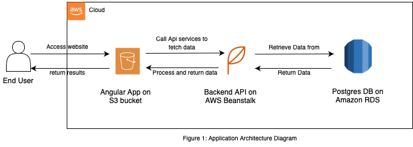

## INFRASTRUCTURE

#### Description

The full stack application includes:

1. Database: Postgres database is hosted on AWS RDS service.
2. Backend Server: A Node Express API is hosted on AWS ElasticBeanstalk.
3. Frontend: An Angular Web App is hosted on AWS S3 Bucket.

The fullstack application is deployed using CircleCI Pipeline Serice.

#### Architecture Diagram

