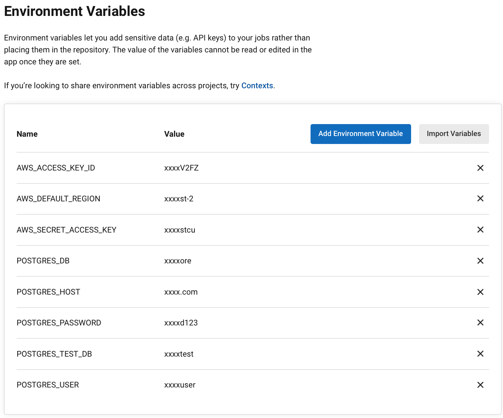
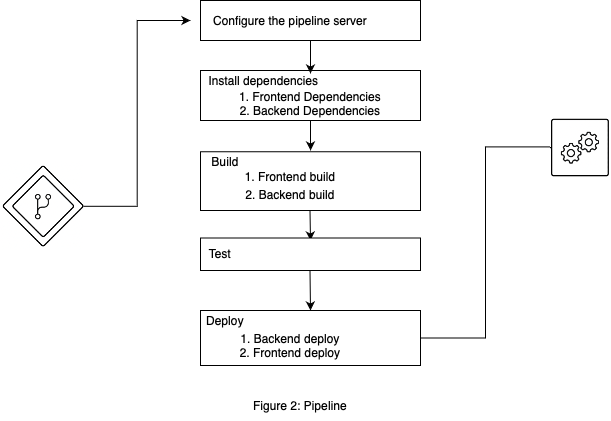

## Pipeline Process

## Description

In this particular project, we choose CircleCI as the CI/CD Software. Before the pipeline process, the following steps must be completed:

1. A Postgres database server is configured and hosted on AWS RDS so that the backend API can retrieve the data.
2. A S3 bucket is initialized on the AWS S3 bucket to store the frontend application code and host the website.
3. The GitHub repository is connected to CircleCI so that every time the developer commits his code, the pipeline will automatically run.
4. Environment variables (secrets) are configured inside CircleCI and will be passed to the production application:
   

The pipeline process details are described in [.circleci/config.yml](../.circleci/circleci.config.yml)

#### Pipeline Diagram

